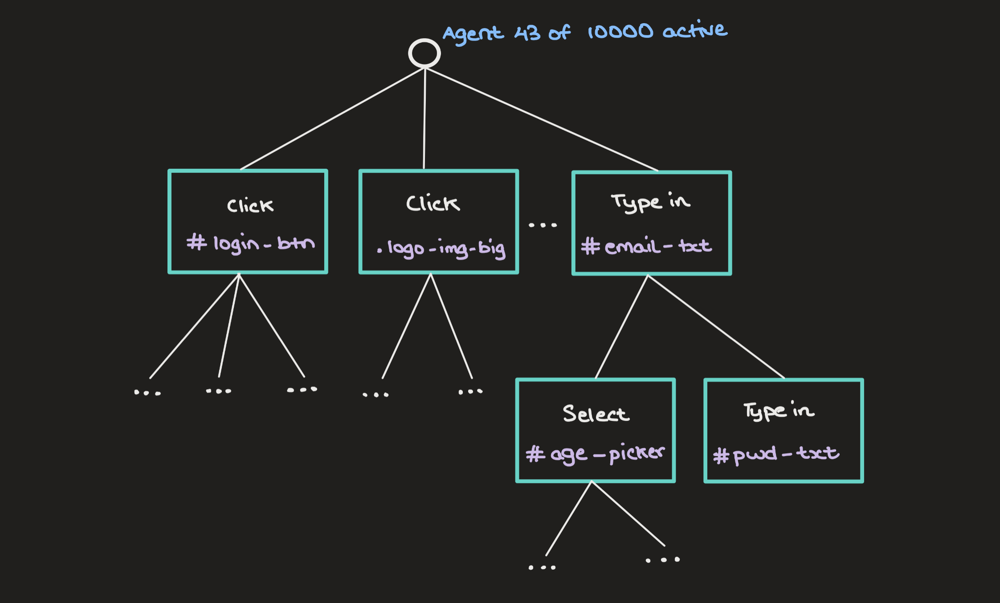
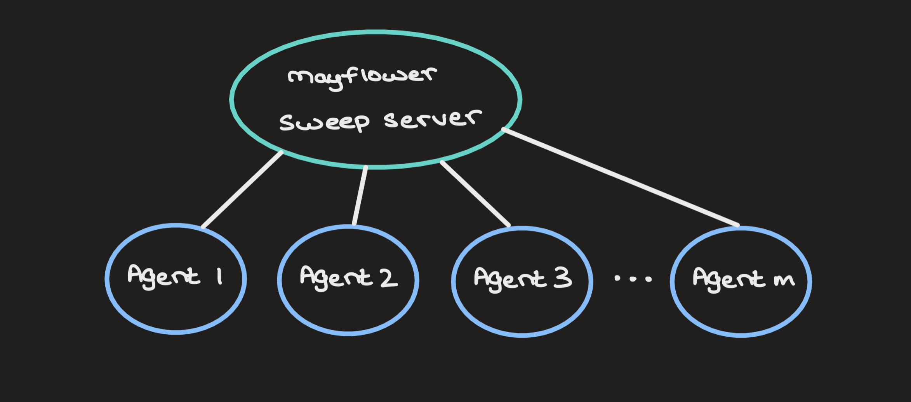

# mayflower [WIP]
Search Tree-based user mimicry for webpage functionality and stress testing

## What is this?
Hyperparameter Sweeps are often used to test different configuations of ML models to get the best-performing set of hyperparameters. To do this, there's a central sweep server that runs different agents in parallel (or serially) and logs their results and metrics over time.

Inspired by this, I envision a tool that mimics users on a website to stress test functionality and find loose ends that can be spotted and fixed quickly. I'm talking bugs that developers often miss during their tests.

### The Name
*Mayflower* was an English ship that transported Englishmen to America in the early 1600s. Likewise, the `mayflower` library "brings" fake users to your webpage and performs possible typical interactions.

## How does it work?
A typical webpage DOM has actionable elements – ones that users interact with (buttons, checkboxes, textboxes, textareas) – and static elements – ones that display information (paragraphs, headings, images, logos). `mayflower` looks at **all** actionable DOM elements and runs random agents that interact with them in different ways.

For each interaction, an agent has a set of actions it can perform (press a button, type text into a textbox, etc.). You can think of this as a *search tree* where each node is an action that can be performed at the current state (pictured below). Real users are like these agent - they perform a sequence of actions on the webpage, transitioning between pages, and end their sessions at random times.



`mayflower` mimics users actions and scales from 1 to 10,000 to stress test your website to bug-free perfection. It does this by launching headless browser instances with the webpage in question, running parallellised agents on it.



## Usage 

1. Install `mayflower` on your local machine via `pip`:

```bash
pip install mayflower
```

2. Have a set of webpages ready (i.e., your web project). Launch the `mayflower` client:

```bash
mayflower test "./pages/login.html"
```

Doing so launches numerous headless browsers with the webpage `login.html` loaded in and starts the agent sweep on this page.

3. View test results:

```bash
mayflower console --all-tests
```

This launches a local browser window on the localhost (port `:8008`) with all the test results in place. The `all-tests` flag shows you all past runs performed on your current project in which `mayflower` has been instantiated.

## Reading results
So you've just run `mayflower` on a set of webpages. When you launch the console to view the test results, you'll be presented with a GUI summarising the tests. Here are some results that are self-explanatory:

<!-- TODO: Add results list -->

## Sweep configurations
You can even specify the configuration to customise the run. The configuration is given to `mayflower` as a JSON file. Here are some examples:

| **param**    | **remarks**                                                                                   | **defaults**   |
|--------------|-----------------------------------------------------------------------------------------------|----------------|
| `num_agents` | Number of active agents on a webpage                                                          | 1 (`int`)      |
| `max_moves`  | Maximum number of moves an agent can perform (search tree depth)                              | 5 (`int`)      |
| `parallel`   | Parallel running of agents or not (parallel runs are billed to your provided billing account) | false (`bool`) |